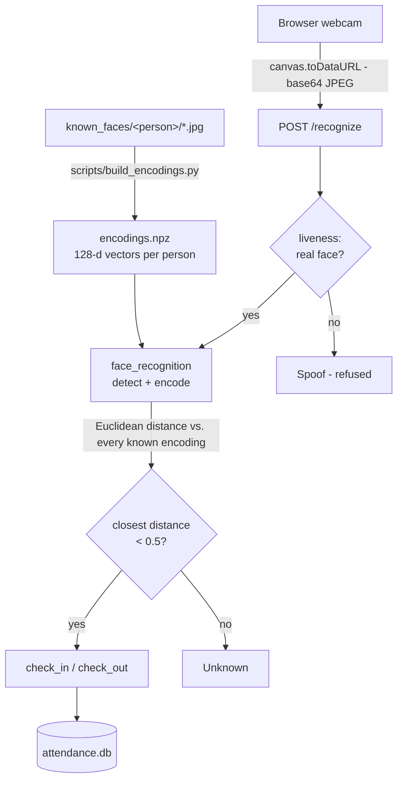

# Face Recognition Attendance System

Browser-based attendance capture: a webcam identifies enrolled people and records them
present, once per day, with arrival and departure times.

[](https://github.com/b1lquees/FaceRecognition-AttendanceSystem/actions/workflows/tests.yml)


Built with Flask, `face_recognition` (dlib), OpenCV and SQLite. The webcam is the
browser's, so nothing needs installing on the machine people walk up to: frames are posted
to the server, matched against enrolled faces, and written to a register that
administrators can export as CSV.

**Status:** working and tested, actively developed. Anti-spoofing is measured but disabled
— see [Anti-spoofing](#anti-spoofing) — and the constraints under
[Known limitations](#known-limitations) are worth reading before deploying this anywhere
that matters.

## Contents

- [Features](#features)
- [Quick start](#quick-start)
- [How it works](#how-it-works)
- [Usage](#usage)
- [Security](#security)
- [Anti-spoofing](#anti-spoofing)
- [Configuration](#configuration)
- [Deployment](#deployment)
- [Development](#development)
- [Known limitations](#known-limitations)
- [Roadmap](#roadmap)
- [Credits](#credits)

## Features

- **Live recognition in the browser.** The webcam feed is captured client-side and sent
  for identification every 1.5 seconds.
- **Check-in and check-out.** One row per person per day, enforced by a database
  constraint, holding both times and the duration between them. Timestamps carry their UTC
  offset, so a shift spanning a daylight-saving change is measured in elapsed time rather
  than in clock faces.
- **Enrolment from the browser.** Administrators add people by uploading photos; the
  running server picks them up without a restart, and says so when a set of photos is too
  alike to be worth having.
- **Role-based access.** `viewer` accounts read the register; `admin` accounts also export
  it, enrol people and approve accounts.
- **Today and archive views.** A daily register, plus a full history paged 50 at a time
  with name-or-date search performed in SQL rather than in the browser.
- **CSV export**, generated in memory and streamed as a download.
- **Anti-spoofing gate.** A liveness model can refuse photographs and screens before
  recognition runs. Ships disabled; calibrate before trusting it.
- **Audit trail.** Every security-relevant action is logged with who did it and from where.
- **Responsive interface.** Sidebar on a laptop, drawer on a phone, tables that become
  cards on narrow screens, and a light/dark theme following the system or your choice.
- **Desktop mode.** `scripts/recognise_live.py` runs the same recognition in a native
  OpenCV window, for testing without a browser.

## Quick start

Requires **Python 3.12+**.

```bash
git clone https://github.com/b1lquees/FaceRecognition-AttendanceSystem.git
```

```bash
cd FaceRecognition-AttendanceSystem && python -m venv venv
```

Activate the environment — `venv\Scripts\activate` on Windows, `source venv/bin/activate`
on macOS and Linux — then install in three steps:

```bash
pip install -r requirements.txt
```

```bash
pip install --no-deps face-recognition==1.3.0
```

```bash
pip install -e . --no-deps
```

<details>
<summary>Why three commands rather than one</summary>

`face-recognition` declares a dependency on `dlib`, which is published only as a source
distribution and needs CMake and a C++ compiler to build. `dlib-bin`, already in
`requirements.txt`, provides the identical `dlib` import as a prebuilt wheel, so
`--no-deps` skips the source build entirely.

The third line installs this project itself in editable mode — no files are copied, pip
just records where the source lives. That is what makes `import attendance` resolve from
any directory, which the scripts in `scripts/` need: Python puts a script's *own*
directory on `sys.path`, not the project root.
</details>

On Linux, OpenCV also needs two system libraries:

```bash
sudo apt-get install -y libgl1 libglib2.0-0
```

Create the database and an administrator account. The password is prompted for, never
passed as an argument:

```bash
python scripts/init_db.py
```

```bash
python scripts/create_user.py alice --role admin
```

And a separate account for the camera station. `--role` defaults to `viewer`, which is the
point: the station needs `/camera` and `/recognize`, and neither requires admin.

```bash
python scripts/create_user.py station
```

> Signing the door camera in as an administrator leaves an unattended admin session in a
> corridor: anyone walking up can enrol a face under somebody else's name, remove people,
> approve accounts, or export the whole attendance archive in one click. It also collapses
> the audit trail, because every one of those actions is then logged as the station rather
> than as a person.

Then run it:

```bash
python wsgi.py
```

Open <http://127.0.0.1:5000/login>, sign in, enrol someone at `/admin/enrol`, and open
`/camera`.

## How it works



Each face becomes a **128-dimensional vector**. Two photos of the same person produce
vectors that sit close together in that space; different people produce vectors far apart.
Identification is therefore finding the nearest stored encoding and checking it is near
enough — the `TOLERANCE` constant in
[`attendance/recognition.py`](attendance/recognition.py), set to `0.5`.

Lower is stricter: fewer false matches, more failures to recognise someone whose
appearance has changed. `0.5` is tighter than the `0.6` dlib suggests by default, because
the two failures are not symmetrical. An unrecognised face is obvious to the person
standing there and costs one 1.5-second retry; the wrong person marked present is a false
record nobody reading the register would ever spot.

Rows recorded under the older, more forgiving cutoff remain in the history, which is why
distances between 0.5 and 0.6 appear there and are shown as borderline.

## Usage

### Enrolling people

The **Enrol** page at `/admin/enrol` takes photo uploads and makes someone recognisable
immediately, with no restart. Several photos at different angles and in different lighting
matter far more than one perfect one, and the page says so when an uploaded set is too
similar to teach the recogniser anything.

To enrol from the shell instead, create one folder per person under `known_faces/`:

```
known_faces/
  Alice/
    photo1.jpg
    photo2.jpg
  Bob/
    photo1.jpg
```

Then rebuild the encoding cache. Photos containing zero or multiple faces are skipped with
a warning:

```bash
python scripts/build_encodings.py
```

### Routes

| Route | Access | Description |
| --- | --- | --- |
| `/login`, `/logout` | public | Sign in and out |
| `/signup` | public | Request an account (created pending, cannot sign in yet) |
| `/healthz` | public | Liveness probe for the container runtime; returns `ok` or 503 |
| `/camera` | any user | Live recognition page |
| `/recognize` | any user | `POST` endpoint that identifies one frame |
| `/attendance/today` | any user | Today's register |
| `/attendance/all` | any user | Full archive, paged and searchable by name or date |
| `/attendance/export` | **admin** | CSV download |
| `/admin/users` | **admin** | Approve or reject access requests |
| `/admin/enrol` | **admin** | Add or remove a person |
| `/account/password` | any user | Change your own password |

### The interface

Navigation is a sidebar. It collapses to a button on laptops and tablets and becomes a
drawer behind a hamburger below 960px, and both remember your choice across pages. The
theme follows the operating system unless you use the switch at the foot of the sidebar,
which then takes precedence. Below 700px the record tables are drawn as one card per row
rather than a table that has to be dragged sideways, keeping match strength and duration
on screen.

### Checking in and out

The camera page has a **Check in / Check out** switch, and the mode travels with each
frame. One row per person per day holds both times:

| Mode | First time today | Again the same day |
| --- | --- | --- |
| Check in | records `time_in` | reports *already checked in* |
| Check out | records `time_out` | reports *already checked out* |

Checking out is a **choice, not an inference**. Setting `time_out` on every sighting would
record a five-minute day for someone who walked past the camera shortly after arriving,
and would make "already checked in" impossible to report. Checking out before checking in
reports *not checked in* and records nothing. A missing or unrecognised mode falls back to
check-in, because an unwanted arrival is correctable and an unwanted departure is worse.

Both times live in the same row, so the `UNIQUE(date, student_id)` index still guarantees
exactly one record per person per day.

## Security

### Accounts and approval

Anyone can request an account at `/signup`, but it is created **pending** and cannot sign
in until an administrator approves it at `/admin/users`. Signup always creates a `viewer`
— the role is not a form field, because if it were, anyone reaching the page could make
themselves an administrator.

Promotion is deliberately a command-line action, so it always requires access to the
server:

```bash
python scripts/create_user.py alice --role admin
```

Accounts created that way are approved immediately: someone with shell access does not
need to ask themselves for permission.

Removing a person at `/admin/enrol` deletes their photos and face data but **keeps their
attendance history**. Un-enrolling stops the system recognising them from now on; it does
not mean they were never there.

### Kiosk mode vs. personal check-in

Two quite different models, chosen with `KIOSK_MODE`:

**Kiosk (`KIOSK_MODE=1`, the default)** — one camera by a door. Anyone enrolled who is
recognised is marked present, whoever happens to be signed in at the station. The account
is the operator running the terminal, not the person being recorded.

**Personal (`KIOSK_MODE=0`)** — each person signs into their own account and checks
themselves in. A recognised face that does not belong to the signed-in account is refused.
This is what makes *"only the registered person can check in"* true: in kiosk mode, being
signed in as anyone lets you mark anyone else present, because the recording path never
consults the session.

Personal mode requires each account to be **linked to an enrolled person**, done by an
administrator at `/admin/users`. Linking is admin-only by design — if people chose their
own identity at signup, anyone could claim to be anyone, which is the exact impersonation
the mode exists to prevent. An unlinked account cannot check in at all.

A refused check-in deliberately does **not** report who was actually recognised. Doing so
would tell the signed-in user who was standing in front of the camera, leaking other
people's presence to anyone able to point a webcam at them.

> Neither mode defends against a **photograph** of the right person — see
> [Anti-spoofing](#anti-spoofing).

> Personal mode is stronger on *who* and weaker on *where*: the account holder can check
> themselves in from anywhere they can reach the site, and neither recognition nor liveness
> can tell. See [Where a check-in may come from](#where-a-check-in-may-come-from).

### Sessions, CSRF and rate limiting

The secret key signs session cookies, and anyone who knows it can forge one claiming
`role=admin`. In development a key is generated and cached in `.flask_secret_dev`
(gitignored). In production `FLASK_SECRET_KEY` is required, and its absence stops the
application starting rather than falling back to something guessable.

Responses carry a Content-Security-Policy. The part that does the work is
`script-src 'nonce-…'`: every inline `<script>` is tagged with a value generated fresh for
that response, so the page's own scripts run and injected ones do not — an injection cannot
carry a nonce it has never seen. `style-src` still allows inline styles, because a nonce
cannot authorise a style *attribute* and a few remain in the templates; injected CSS is a
much narrower problem than injected script, but it is a real gap rather than an oversight.

Logging in clears the session first, so nothing from before the sign-in — the CSRF token
included — carries into the authenticated one.

Sessions last **seven days**, counted from login. This was always bounded, at Flask's
default of 31 days, and enforced server-side; seven is simply a value somebody chose. Be
clear about what it is not: with signed cookies there is no server-side session to
invalidate, so nothing can revoke a leaked cookie early short of rotating
`FLASK_SECRET_KEY`, which signs out everyone including the camera station. The ceiling is
absolute rather than idle — traffic does not extend it — which is why it is measured in
days: a shorter one would expire the door camera mid-use, and a camera that has stopped
recording is the failure this system can least afford.

> **Sign the camera station in as a `viewer`, not an `admin`.** In kiosk mode the account
> is the operator, not the person being recorded, so it needs no admin rights — and an
> unattended admin session sitting at a door is worth more to an attacker than any session
> length protects against. This is the cheapest security decision available here.

Every `POST` is CSRF-protected by a token held in the session
([`attendance/security.py`](attendance/security.py)). Forms carry it in a hidden field;
`/recognize` posts JSON, so it sends the same value as an `X-CSRF-Token` header.

Four routes are rate limited ([`attendance/ratelimit.py`](attendance/ratelimit.py)): 10
login attempts per 5 minutes, 10 password changes per 5 minutes, 5 signups per hour, and
60 frames a minute on `/recognize`. The first three guard a password or the approval
queue; the last one guards the CPU, since recognising a frame is the only genuinely
expensive thing the server does.

The first three count per client address, which is the only unit available — they are
attacked by somebody who is not signed in, so the session says nothing. `/recognize`
counts per address in kiosk mode and **per account in personal mode**, because the limit
is sized for one camera and in personal mode one address is not one camera: twenty people
checking in from their own browsers leave an office through one gateway, and counting them
together would 429 everyone after the first.

The counters live in process memory, so they reset on restart and each worker keeps its
own — adequate for a single classroom-sized deployment, but anything larger wants
Flask-Limiter backed by Redis so the count is shared. The store is capped at 10,000
counters and evicts the least recently used beyond that, so cycling through source
addresses exhausts memory in neither direction.

**Set `TRUSTED_PROXY_HOPS` if there is a proxy in front**, or all of these collapse into
one bucket shared by every client — see [Configuration](#configuration).

### Audit trail

Security-relevant actions are written to a log
([`attendance/audit.py`](attendance/audit.py)): logins and failures, signups, approvals,
rejections, account linking, enrolment, removal, refused spoof attempts, and check-ins
refused for coming from off site — each with who did it and from where. Passwords, tokens
and face encodings are never logged.

## Anti-spoofing

Recognition alone cannot tell a person from a photograph of them: a printed photo produces
the same encoding the real person does, so it checks them in. A liveness model
([facenox/face-antispoof-onnx](https://github.com/facenox/face-antispoof-onnx), Apache 2.0,
weights and licence in `attendance/models/`) runs **before** recognition and refuses
spoofs, so a photo is never identified at all — which is also why a refusal does not report
whose photo it was.

**It ships disabled**, because the right threshold depends on your camera and your lighting,
and nobody can pick it for you from the outside.

### What calibration found here

On the laptop webcam this was developed on, 40 samples each, a phone screen as the spoof:

| | min | median | max |
| --- | --- | --- | --- |
| Real face | −3.18 | **+1.21** | +6.61 |
| Photo / screen | −6.19 | **−3.31** | +1.05 |

**Those ranges overlap, and the overlap is fatal.** Half the genuine frames score below
the best spoof frame. Blocking every spoof needs a threshold of `+1.06`, which refuses
**20 of 40 real frames**; leaving the default `0.0` refuses 40% of real frames *and*
admits 8% of spoof frames. No setting on this camera is worth having, so the feature stays
off.

Two findings from that measurement generalise:

- **No middle setting helps, because both sides retry.** A threshold admitting 22% of
  spoof frames looks like a compromise until you remember the attacker is still holding
  the phone up: at one check every 1.5 seconds, a photo is through in under five seconds.
  Only 0% admitted is worth anything, and that is the expensive end.
- **The score moves more with lighting than with liveness.** Two runs of the same face on
  the same camera an hour apart gave `+0.87 → +7.22` with nothing negative, then
  `−3.18 → +6.61` with 40% negative. A threshold tuned in one lighting condition is wrong
  in the next — a stronger argument against depending on this than the overlap itself.

### Calibrating your own camera

Your camera may separate cleanly. Measure before assuming either way. Run it as yourself,
then again holding up a printed photo or a face on a phone screen:

```bash
python scripts/calibrate_liveness.py --label real
```

```bash
python scripts/calibrate_liveness.py --label spoof
```

Each run saves its raw scores, in capture order, next to the script. Then, with no camera
needed:

```bash
python scripts/calibrate_liveness.py --compare
```

`--compare` pools every saved run, and reports first how much each one actually measured.
That part matters more than the thresholds it prints. Frames captured back to back are
nearly the same measurement — on the runs in this repository the frame-to-frame correlation
is **+0.91**, which makes 40 samples worth about **two** independent observations. A
threshold priced on two observations is an anecdote with decimal places, and it explains the
instability between two runs an hour apart better than lighting alone does.

So capture across time rather than in one burst, and tag each condition:

```bash
python scripts/calibrate_liveness.py --label real --tag morning --interval 5
```

Repeat for `spoof`, then again with `--tag midday`, `--tag dusk`, `--tag dark`. Runs
accumulate instead of overwriting each other, and `--compare` pools the lot — which is the
point, since one threshold has to survive every condition the door sees.

```bash
python scripts/calibrate_liveness.py --consecutive
```

prices a gate that requires several frames in a row to agree rather than judging one at a
time. It does not compound the way independent sampling would — with correlation that high,
a frame that passed makes the next one likely to pass too — but it still helps, for a
different reason: a spoof must *sustain* a score rather than touch it once, so the threshold
can come down, and a lower threshold refuses fewer real people. On the runs here that moves
real acceptance from 50% to 69% at zero spoofs admitted, across five frames.

That prices every threshold behaving differently from its neighbours — real frames refused
against spoof frames admitted — and names the cheapest one that blocked every spoof, with
what it costs. If that cost exceeds a quarter of genuine frames it tells you to leave the
feature off rather than handing you a number, because a gate refusing a quarter of
someone's frames has stopped being a gate.

If it does give you a threshold:

```bash
set LIVENESS_ENABLED=1
```

```bash
set LIVENESS_THRESHOLD=<the number it printed>
```

If it starts refusing you, set `LIVENESS_ENABLED=0` and recalibrate rather than lowering
the threshold until everything passes. Lowering it until you get in is exactly the motion
that leaves the gate switched on and doing nothing.

## Configuration

| Variable | Default | Description |
| --- | --- | --- |
| `FLASK_SECRET_KEY` | generated for development | Signs session cookies. **Required in production.** |
| `APP_ENV` | unset | `production` makes a missing secret key a hard error and requires HTTPS for the session cookie. The former name `FLASK_ENV` is still read, with a warning. |
| `TRUSTED_PROXY_HOPS` | `0` (none), `1` under compose | How many reverse proxies are in front. Set it to the real number when deploying behind one, or every client shares one rate-limit bucket. Never set it higher than the number of proxies you actually run. |
| `LIVENESS_ENABLED` | `0` (off) | Anti-spoofing. Calibrate before turning on. |
| `LIVENESS_THRESHOLD` | `0.0` | Score above which a face counts as real. Higher is stricter. |
| `KIOSK_MODE` | `1` (on) | `1` for a shared door camera, `0` for personal check-in. |
| `TIMEZONE` | the machine's | IANA name, e.g. `Europe/London`. Times are recorded in this zone. |
| `LOG_LEVEL` | `INFO` | The audit trail is logged at INFO; raising this discards it. |
| `LOG_FILE` | unset | Also write a rotating log file. Unset means stderr only. |
| `ATTENDANCE_DB` | `attendance.db` | Path to the SQLite database. |
| `KNOWN_FACES_DIR` | `known_faces/` | Where enrolment photos are stored. |
| `ENCODINGS_FILE` | `encodings.npz` | Where the encoding cache is written. |

The last three are everything this application writes. They default to sitting beside the
source, which suits a checkout and not a container, where the code lives in an image that
gets rebuilt and discarded while the data has to outlive it.

Generating a production key:

```bash
export FLASK_SECRET_KEY=$(python -c "import secrets; print(secrets.token_hex(32))")
```

## Deployment

### With compose (recommended)

[`docker-compose.yml`](docker-compose.yml) runs the application behind
[Caddy](https://caddyserver.com/), which terminates TLS. Two things make this the way to
deploy rather than a convenience:

- **The app gets no host port.** `docker run -p 8000:8000` publishes gunicorn straight onto
  the host, so anyone on the network can reach it over plain HTTP and bypass the proxy
  entirely. Under compose only Caddy listens; the app is reachable solely on the private
  network between the two.
- **The camera needs HTTPS to work at all.** `getUserMedia()` is only exposed in a secure
  context. Over plain HTTP to anything but `localhost`, `navigator.mediaDevices` is
  *undefined* and the page cannot open a camera. This is a stronger requirement than
  `SESSION_COOKIE_SECURE` — the kiosk does not degrade without TLS, it stops working.

```bash
cp .env.example .env
```

Put a generated key in it, then:

```bash
docker compose up -d
```

Set up the schema and the first administrator on the volume the stack uses:

```bash
docker compose run --rm app python scripts/init_db.py
```

```bash
docker compose run --rm app python scripts/create_user.py alice --role admin
```

And a separate account for the camera station. `--role` defaults to `viewer`, which is the
point: the station needs `/camera` and `/recognize`, and neither requires admin.

```bash
docker compose run --rm app python scripts/create_user.py station
```

> Signing the door camera in as an administrator leaves an unattended admin session in a
> corridor: anyone walking up can enrol a face under somebody else's name, remove people,
> approve accounts, or export the whole attendance archive in one click. It also collapses
> the audit trail, because every one of those actions is then logged as the station rather
> than as a person.

**Choose your certificate** in [`Caddyfile`](Caddyfile). It ships configured for the common
case — a camera on a LAN with no public DNS name — where Caddy runs its own certificate
authority. That needs one manual step: export its root certificate and install it in the
kiosk machine's trust store.

```bash
docker compose cp caddy:/data/caddy/pki/authorities/local/root.crt .
```

> Do **not** click through the browser's certificate warning instead. An overridden
> certificate error leaves the page in a state where camera access is unreliable, which is
> the one capability this deployment exists for.

If you do have a hostname that resolves publicly with ports 80 and 443 reachable, the
`Caddyfile` has a two-line alternative that obtains a Let's Encrypt certificate on first
start and renews it indefinitely — no certbot, no cron, no reload hook.

`TRUSTED_PROXY_HOPS=1` is set for you in the compose file, because Caddy is exactly one hop
and sets `X-Forwarded-For` itself.

**The app service has a healthcheck**, and it is worth knowing what it does and does not
do. Gunicorn's own `--timeout 60` already reaps a worker wedged mid request, so a hung
worker was covered before the healthcheck existed. What the arbiter cannot see is a
container that is up, responsive, and has nothing to serve — brought up without anyone
running `init_db.py`, so every page fails on its first query. That is what `/healthz`
looks for: the schema, not merely a file it can open.

> Docker's vocabulary oversells this. Marking a container **unhealthy does not restart
> it** — Compose acts on health only in `depends_on`, and restart-on-unhealthy is a Swarm
> feature. What you get is `docker compose ps` telling the truth instead of reporting
> `Up 6 days` for a container that has served nothing but errors for five of them. Check
> it, or put something in front that does.

```bash
docker compose ps
```

Caddy deliberately waits only for the app to *start*, not to become healthy. The order in
this section is `up -d` first and `init_db.py` second, so on a first deployment the app is
legitimately unhealthy for as long as it takes you to run that command — and gating the
proxy on health would mean no web server at all during the window when you most want to
see an error page.

### By hand

The image contains the application and nothing else. `.dockerignore` keeps the database,
the photos and the encoding cache out of the build context deliberately — face data has no
business inside an image that gets pushed to a registry — so a fresh container starts empty
and writes everything into `/data`.

**Mount something there.** Without a volume, `/data` is the container's own writable layer
and `docker rm` deletes the attendance record along with the container.

```bash
docker build -t attendance .
```

```bash
docker volume create attendance-data
```

Create the schema and the first administrator inside throwaway containers, on the volume
the real one will use. `--rm` deletes the container afterwards; the volume keeps what the
scripts wrote:

```bash
docker run --rm -it -v attendance-data:/data attendance python scripts/init_db.py
```

```bash
docker run --rm -it -v attendance-data:/data attendance python scripts/create_user.py alice --role admin
```

And a separate account for the camera station. `--role` defaults to `viewer`, which is the
point: the station needs `/camera` and `/recognize`, and neither requires admin.

```bash
docker run --rm -it -v attendance-data:/data attendance python scripts/create_user.py station
```

> Signing the door camera in as an administrator leaves an unattended admin session in a
> corridor: anyone walking up can enrol a face under somebody else's name, remove people,
> approve accounts, or export the whole attendance archive in one click. It also collapses
> the audit trail, because every one of those actions is then logged as the station rather
> than as a person.

Then run it:

```bash
docker run -d --name attendance -p 8000:8000 -v attendance-data:/data -e FLASK_SECRET_KEY=CHANGE-ME -e TIMEZONE=Asia/Karachi -e TRUSTED_PROXY_HOPS=1 attendance
```

The key is not optional: the image sets `APP_ENV=production`, and production refuses to
start without one rather than falling back to a guessable default.

> **It will not work over plain HTTP, by design.** `APP_ENV=production` also sets
> `SESSION_COOKIE_SECURE`, so the browser is told to send the session cookie over HTTPS
> only. Over `http://localhost:8000` the login succeeds, the cookie is dropped, and the
> next page returns you to the login form as though the password were wrong. Put a
> TLS-terminating proxy in front of it; that is the fix, not disabling the flag.

> **Tell the application about that proxy.** Once there is one in front, every request
> arrives from the proxy's address, so without `TRUSTED_PROXY_HOPS` the rate limiter sees
> a single client no matter how many there are and the audit trail records one address for
> everybody. The `docker run` line above sets it to `1`, which is right for a single proxy.
> Count the hops and set the real number: too low is merely useless, but **too high is
> worse than leaving it unset**, because `X-Forwarded-For` is written by the client, so
> trusting one hop more than exists lets anyone claim any address they like.

> **On Windows, run these from PowerShell or CMD rather than Git Bash**, which rewrites
> arguments that look like Unix paths — `... attendance ls /data` becomes
> `ls C:/Program Files/Git/data` inside the container. Prefix with `MSYS_NO_PATHCONV=1` to
> stay in Git Bash.

Two more things worth knowing:

- **The container's clock is UTC** unless you pass `TIMEZONE`. Attendance times are
  recorded in the configured zone, so a register kept in one timezone and a container
  running in another disagree by however many hours separate them.
- **The camera is the browser's, not the container's.** Frames are captured by the page and
  posted to `/recognize`, so nothing needs a webcam passed into the container.
- **A stopped camera shows a full-screen red `NOT RECORDING` panel.** Nothing server-side
  can detect this state — no frames arrive, and silence is indistinguishable from an empty
  room — so the screen is the only alarm there is. If you see it, attendance is not being
  recorded and somebody needs to sign the station back in.

### Backups

Everything the deployment cannot afford to lose is in two Docker volumes, and neither is
backed up by anything. A named volume survives `docker compose down`, which is what makes
it feel safe; it does not survive `docker compose down -v`, a pruned host, or a dead disk.

| Volume | Holds | If you lose it |
| --- | --- | --- |
| `attendance-data` | `attendance.db`, `known_faces/`, `encodings.npz` | The attendance record and every enrolled face. Everyone re-enrols from photographs you no longer have. |
| `caddy-data` | The internal CA's private key and issued certificates | Caddy generates a new CA, and every kiosk that trusted the old root has to be visited and re-trusted by hand. |

`encodings.npz` is the one thing here that is derivable — `scripts/build_encodings.py`
rebuilds it from `known_faces/`. Back it up anyway; restoring it is a file copy, and
rebuilding it is a job.

**Do not back the database up by copying the file.** The database runs in WAL mode, so at
any instant the committed state is spread across `attendance.db` and `attendance.db-wal`.
`cp` reads them at different moments and can produce a database missing its most recent
check-ins, or one that will not open at all — and it fails this way only when someone was
being marked present mid-copy, which is to say rarely, and never while you are testing the
backup.

SQLite's own backup API takes a consistent snapshot of a live database with writers
attached, which is exactly the situation here:

```bash
docker compose exec app python -c "import sqlite3, pathlib; pathlib.Path('/data/backup').mkdir(exist_ok=True); source = sqlite3.connect('/data/attendance.db'); target = sqlite3.connect('/data/backup/attendance.db'); source.backup(target); target.close(); source.close()"
```

Then copy the snapshot and the photographs off the host:

```bash
docker compose cp app:/data/backup/attendance.db ./attendance-backup.db
```

```bash
docker compose cp app:/data/known_faces ./known_faces-backup
```

```bash
docker compose cp caddy:/data/caddy ./caddy-backup
```

**Off the host.** A backup on the same disk as the thing it protects covers exactly one
failure — a mistaken `down -v` — and not the one that takes the machine.

> **Treat the backup as biometric data, because it is.** `known_faces/` is a folder of
> photographs of identifiable people and `encodings.npz` is a mathematical description of
> their faces; neither becomes less sensitive for being in a tarball on a laptop. Whatever
> obligations apply to the running system — encryption at rest, access control, a
> retention limit, deleting someone's data when they ask — apply to every copy of it. A
> backup nobody remembers taking is the copy that outlives the retention policy.

#### Restoring

Stop the application first. Restoring underneath a running worker means overwriting a file
that has connections open on it, which is the corruption case above with the steps in the
other order.

```bash
docker compose stop app
```

```bash
docker compose cp ./attendance-backup.db app:/data/attendance.db
```

```bash
docker compose cp ./known_faces-backup app:/data/known_faces
```

**Then fix the ownership, or the application will start and fail to write.** The container
runs as uid 10001, and `docker compose cp` writes what it copies in as root — so a restored
database is readable, every page renders, and the first check-in of the day fails with
"attempt to write a readonly database".

```bash
docker compose exec -u root app chown -R attendance:attendance /data
```

> **On Windows, run that one from PowerShell or CMD.** It is the exact shape Git Bash
> rewrites — `/data` becomes `C:/Program Files/Git/data` and the command fails with
> "cannot access", having changed nothing, while the database stays root-owned and the
> next check-in still fails. `MSYS_NO_PATHCONV=1` in front of it is the Git Bash fix.

The healthcheck catches this state, so you do not have to remember to look for it:
`/healthz` treats a database it cannot write to as unhealthy, for exactly this reason.

```bash
docker compose start app
```

There is one thing to delete rather than restore: the old `attendance.db-wal` and
`attendance.db-shm` sidecars, if any came along. They belong to the database that was
replaced, and SQLite will recreate them.

**Test the restore before you need it**, on a throwaway volume rather than the live one. An
untested backup is a belief about a file, and the failure mode of that belief is finding
out on the morning the disk dies.

## Development

### Project layout

The application is built by a **factory function**. Nothing is created at import time:
`create_app()` builds a Flask app on demand, which is what lets the test suite construct a
throwaway app with its own configuration and database.

```
wsgi.py                     entry point (dev server and gunicorn/waitress)
attendance/
    __init__.py             create_app() -- the application factory
    config.py               per-environment settings and secret key handling
    db.py                   connection helper, schema and migrations
    attendance_db.py        attendance queries
    auth_db.py              password hashing, approval, user verification
    decorators.py           @login_required / @admin_required
    security.py             CSRF token generation and checking
    recognition.py          identify_face() and the encoding cache
    liveness.py             anti-spoofing gate
    enrolment.py            adding a person from the browser
    clock.py                timezone-aware timestamps
    pagination.py           which slice of a list to show
    formatting.py           duration, time and match-column display helpers
    ratelimit.py            per-route request throttling
    audit.py                logging setup and the audit trail
    errors.py               the 404/413/500 pages, in the site's own design
    models/                 the anti-spoofing weights and their licence
    routes/                 one module per area of the site
    templates/              base.html plus one file per page
    static/
scripts/                    command-line tools
tests/                      pytest suite
docs/notes.md               learning notes
pyproject.toml              package declaration, pytest and ruff configuration
```

### Command-line tools

Everything in `scripts/` is run directly and does one job. They import `attendance`, which
is why the project has to be installed with `pip install -e .`.

| Script | What it does |
| --- | --- |
| `init_db.py` | Create the tables (safe to re-run) |
| `create_user.py` | Add an account, prompting for the password |
| `build_encodings.py` | Rebuild the encoding cache from `known_faces/` |
| `recognise_live.py` | Desktop webcam viewer, same recognition without a browser |
| `peek_db.py` | Print every attendance row |
| `reset_attendance.py` | Delete one person's records, by name |
| `reset_password.py` | Set a new password for an account |
| `webcam_test.py` | Check the camera works at all |
| `calibrate_liveness.py` | Measure the anti-spoofing model, and price thresholds with `--compare` |

### Tests

```bash
pip install -r requirements-dev.txt
```

```bash
pytest -v
```

519 tests covering attendance de-duplication, recognition of unknown faces, password
hashing, route-level authentication and authorisation, schema migrations, timezone
handling, enrolment validation, the stylesheet's own invariants and the calibration
arithmetic. Every test runs against a throwaway database in pytest's temporary directory,
so the real `attendance.db` is never touched.

Linting is `ruff`, configured in `pyproject.toml`:

```bash
ruff check .
```

CI runs both on every push, on Ubuntu and Windows — development happens on one and
deployment on the other, and every CI failure this project has had was a difference between
them rather than a broken test.

## Known limitations

Real constraints, not nearly-finished work. Worth reading before using this anywhere that
matters.

- **Anti-spoofing ships off, and on the camera it was measured against it has to stay
  off.** With `LIVENESS_ENABLED=0`, the default, holding a photo up to the camera marks
  that person present. It has been calibrated rather than left unmeasured, and the
  measurement said no — see [Anti-spoofing](#anti-spoofing). Calibrate your own camera
  before assuming it behaves the same.
- **Even calibrated, it does not stop a video replay** on a good screen. It raises the bar
  well above "a printed photo works"; it does not eliminate the attack.
- **Personal mode proves who is at the camera, never where the camera is.** With
  `KIOSK_MODE=0` a signed-in person checks themselves in from whatever browser they are
  holding, and nothing in the request distinguishes the office from their kitchen. The
  client's address is read twice on the way through — once to count requests, once to write
  the audit line — and neither reading affects whether a row is recorded. Nothing in the
  recognition path can close this: a stricter `TOLERANCE` does not help, because it is the
  right person, and liveness does not help, because it is a live face. Kiosk mode has the
  opposite gap and gets location for free, because there is one camera and somebody screwed
  it to a wall. The constraint has to come from outside recognition entirely.
- **Recognition runs synchronously in the request thread.** Detection uses a half-scale
  frame, but encoding cannot — roughly 1.2s per frame on modest hardware. Fine for one
  camera; it will not hold up under concurrent users.
- **Enrolment quality is only as good as the photos.** The interface warns when a set is
  too uniform, but nothing forces variety.
- **SQLite suits a single classroom-sized deployment.** WAL mode and a busy timeout remove
  the everyday contention, but this is not a multi-site or high-concurrency design.
- **Attendance rows predating the timezone migration carry a best guess.** Times were once
  stored with no offset, so the migration interprets them in the configured zone — correct
  if the server has not moved, and the only defensible guess if it has. Rows written since
  are exact.
- **Recognition accuracy depends heavily on enrolment photo quality.** The underlying model
  is also documented to be less accurate on children and to have measurably uneven accuracy
  across demographic groups.

## Roadmap

- [x] Restructure into a package with a Flask application factory
- [x] Web-based enrolment, so adding a person does not need shell access
- [x] Pagination on the all-records view
- [x] Docker image and a production WSGI entry point
- [x] Calibrate anti-spoofing — done, and the answer was no on this camera
- [ ] Revisit anti-spoofing with fixed lighting, or a camera whose scores are stable across
      the day; the overlap is a property of this setup, not necessarily of the model.
      **Measure the sampling first** — `--consecutive` reports that the existing runs are
      worth about two independent samples each, so the next experiment needs `--interval`
      and several `--tag`ged conditions before any camera is bought
- [x] `docker-compose.yml` with TLS termination, so the run instructions stop needing a
      caveat
- [x] A backup and restore procedure, and a healthcheck that can tell a running container
      from a serving one

## Credits

- Face detection and encoding: [dlib](http://dlib.net/) via
  [`face_recognition`](https://github.com/ageitgey/face_recognition).
- Liveness model: [facenox/face-antispoof-onnx](https://github.com/facenox/face-antispoof-onnx),
  Apache 2.0. The weights and licence text are included in `attendance/models/`.
