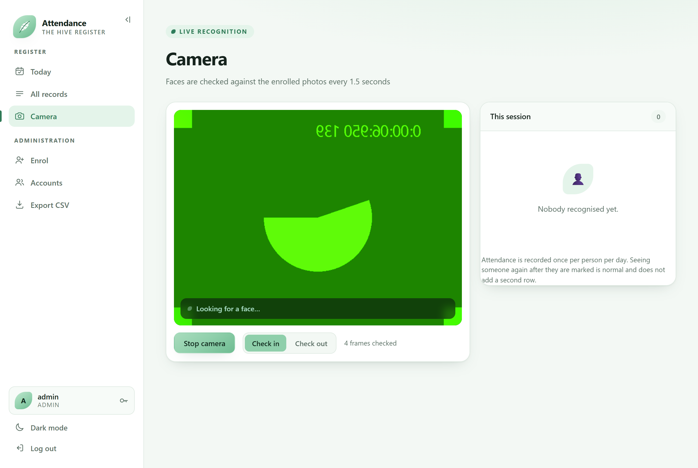
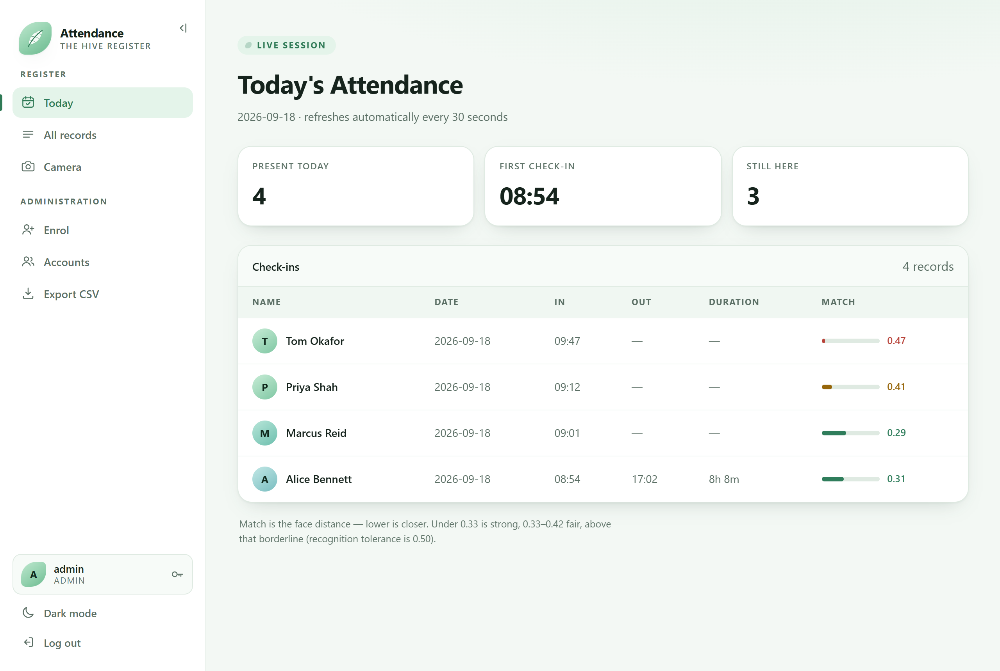
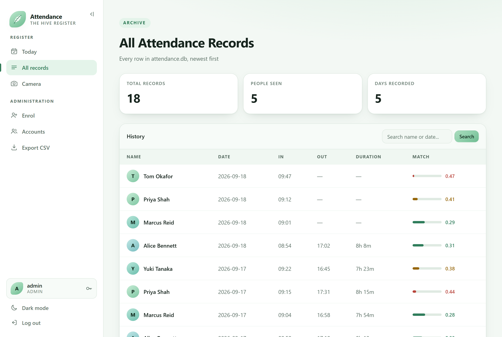
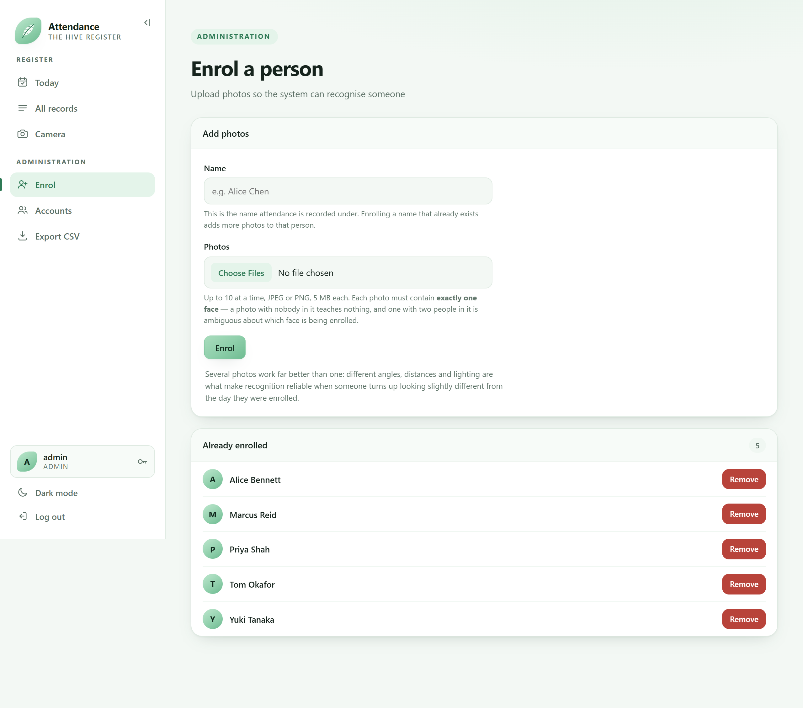
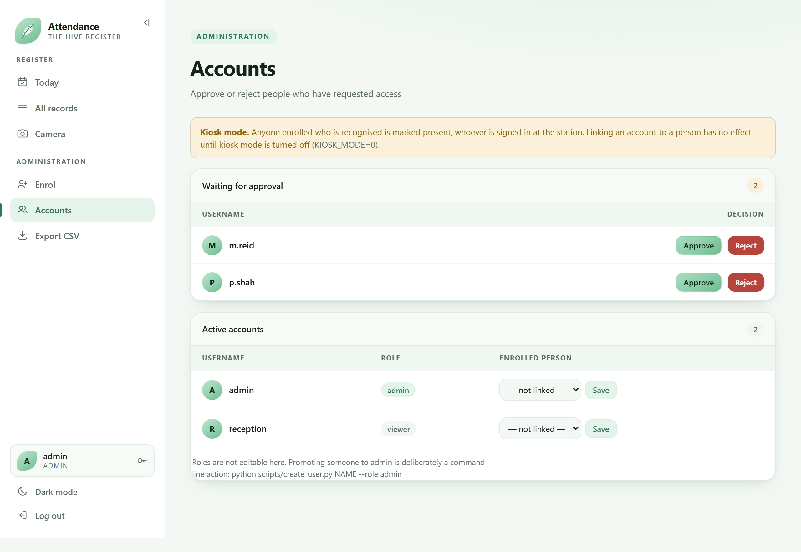
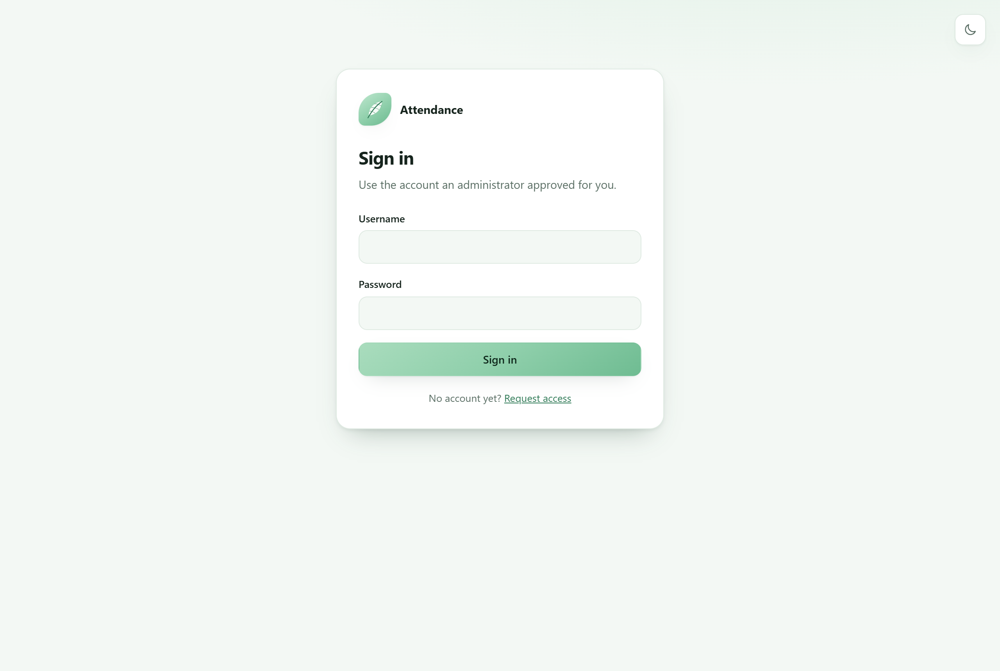
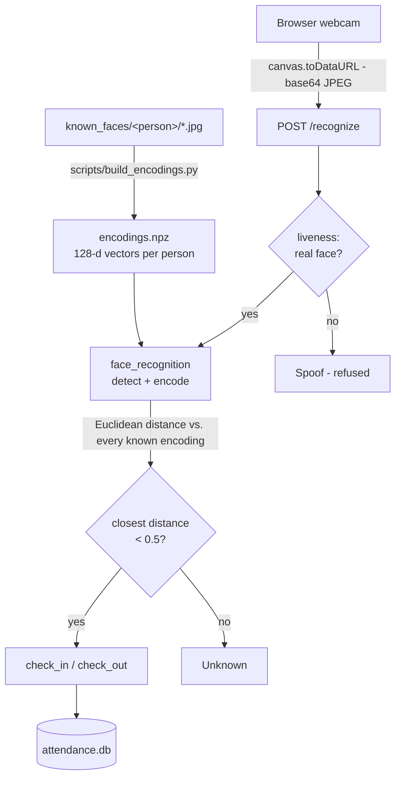

# Face Recognition Attendance System

Browser-based attendance capture: a webcam identifies enrolled people and records them
present, once per day, with arrival and departure times.

[](https://github.com/b1lquees/FaceRecognition-AttendanceSystem/actions/workflows/tests.yml)


Built with Flask, `face_recognition` (dlib), OpenCV and SQLite. The webcam is the
browser's, so nothing needs installing on the machine people walk up to: frames are posted
to the server, matched against enrolled faces, and written to a register that
administrators can export as CSV.


## Contents

- [Screenshots](#screenshots)
- [Features](#features)
- [Tech stack](#tech-stack)
- [Repository layout](#repository-layout)
- [Quick start](#quick-start)
- [How it works](#how-it-works)
- [Performance](#performance)
- [Usage](#usage)
- [Security](#security)
- [Anti-spoofing](#anti-spoofing)
- [Configuration](#configuration)
- [Deployment](#deployment)
- [Development](#development)
- [Known limitations](#known-limitations)
- [Roadmap](#roadmap)
- [Credits](#credits)
- [Licence](#licence)

The longer material lives in [`docs/`](docs/), linked from the sections it belongs to:

| Page | What is in it |
| --- | --- |
| [docs/security.md](docs/security.md) | Threat model, the two check-in modes, what a check-in proves about location, sessions, CSRF, rate limiting and the audit trail |
| [docs/liveness-calibration.md](docs/liveness-calibration.md) | How the anti-spoofing model was measured, what it found, and how to measure your own camera |
| [docs/deployment.md](docs/deployment.md) | Certificates, the healthcheck, and running the container without compose |
| [docs/backup-restore.md](docs/backup-restore.md) | Taking a consistent snapshot of a live database, and putting it back |
| [docs/notes.md](docs/notes.md) | Learning notes written while building this |

## Screenshots

The camera page is the only one most people ever see: a live view, a check-in/check-out
switch, and a running list of who has been recognised in this session.



<sub>Captured headlessly, so the video panel is showing the browser's synthetic test
camera rather than a room.</sub>

| Today's register | Full archive |
| --- | --- |
| [](docs/screenshots/attendance-today.png) | [](docs/screenshots/attendance-archive.png) |
| One row per person per day, with arrival, departure, duration and how close the face match was. | Every row ever recorded, paged 50 at a time and searchable by name or date. |

| Enrolment | Accounts |
| --- | --- |
| [](docs/screenshots/enrolment.png) | [](docs/screenshots/admin-users.png) |
| Administrators add a person by uploading photos; the running server picks them up without a restart. | The approval queue, and the account-to-person links that personal mode depends on. |

<details>
<summary>Sign-in page</summary>



Accounts are requested at `/signup` and stay pending until an administrator approves them.
</details>

The data in these is invented — the names, the times and the match distances all come from
a throwaway database built for the capture, so nothing here is anybody's real attendance.

## Features

- **Live recognition in the browser.** The webcam feed is captured client-side and sent
  for identification every 1.5 seconds.
- **Check-in and check-out.** One row per person per day, enforced by a database
  constraint, holding both times and the duration between them. Timestamps carry their UTC
  offset, so a shift spanning a daylight-saving change is measured in elapsed time rather
  than in clock faces.
- **Enrolment from the browser.** Administrators add people by uploading photos; the
  running server picks them up without a restart, and says so when a set of photos is too
  alike to be worth having.
- **Role-based access.** `viewer` accounts read the register; `admin` accounts also export
  it, enrol people and approve accounts.
- **Today and archive views.** A daily register, plus a full history paged 50 at a time
  with name-or-date search performed in SQL rather than in the browser.
- **CSV export**, generated in memory and streamed as a download.
- **Anti-spoofing gate.** A liveness model can refuse photographs and screens before
  recognition runs. Ships disabled; calibrate before trusting it.
- **Audit trail.** Every security-relevant action is logged with who did it and from where.
- **Desktop mode.** `scripts/recognise_live.py` runs the same recognition in a native
  OpenCV window, for testing without a browser.

## Tech stack

| Layer | What it uses |
| --- | --- |
| Language | Python 3.12+ |
| Web framework | Flask, built by an application factory |
| Face detection and encoding | [`face_recognition`](https://github.com/ageitgey/face_recognition) over dlib, installed as prebuilt `dlib-bin` wheels |
| Image handling | OpenCV, NumPy |
| Liveness | ONNX Runtime, running [facenox/face-antispoof-onnx](https://github.com/facenox/face-antispoof-onnx) |
| Database | SQLite in WAL mode, with its schema and migrations in-tree |
| Frontend | Server-rendered Jinja templates, one hand-written stylesheet, no build step |
| WSGI server | gunicorn in the image, waitress on Windows, Flask's own server in development |
| Reverse proxy and TLS | Caddy |
| Packaging | Docker, `docker-compose.yml` |
| Tests, linting, CI | pytest, ruff, GitHub Actions |

## Repository layout

```
FaceRecognition-AttendanceSystem/
├── attendance/            the application package
│   ├── routes/            one module per area of the site
│   ├── templates/         base.html plus one file per page
│   ├── static/            stylesheet and the client-side camera code
│   ├── models/            anti-spoofing weights and their licence
│   ├── recognition.py     identify_face() and the encoding cache
│   ├── liveness.py        the anti-spoofing gate
│   └── db.py              connection helper, schema and migrations
├── scripts/               command-line tools (init, enrol, calibrate, inspect)
├── tests/                 pytest suite
├── docs/                  the longer documentation
├── known_faces/           enrolment photos (never in version control)
├── docker-compose.yml
├── Dockerfile
├── Caddyfile
└── pyproject.toml
```

Every module in the package is listed with what it does under
[Project layout](#project-layout).

## Quick start

Requires **Python 3.12+**.

```bash
git clone https://github.com/b1lquees/FaceRecognition-AttendanceSystem.git
cd FaceRecognition-AttendanceSystem
python -m venv venv
```

Activate the environment — `venv\Scripts\activate` on Windows, `source venv/bin/activate`
on macOS and Linux — then install in three commands:

```bash
pip install -r requirements.txt
pip install --no-deps face-recognition==1.3.0
pip install -e . --no-deps
```

<details>
<summary>Why three commands rather than one</summary>

`face-recognition` declares a dependency on `dlib`, which is published only as a source
distribution and needs CMake and a C++ compiler to build. `dlib-bin`, already in
`requirements.txt`, provides the identical `dlib` import as a prebuilt wheel, so
`--no-deps` skips the source build entirely.

The third line installs this project itself in editable mode — no files are copied, pip
just records where the source lives. That is what makes `import attendance` resolve from
any directory, which the scripts in `scripts/` need: Python puts a script's *own*
directory on `sys.path`, not the project root.
</details>

On Linux, OpenCV also needs two system libraries:

```bash
sudo apt-get install -y libgl1 libglib2.0-0
```

Create the database and an administrator account. The password is prompted for, never
passed as an argument:

```bash
python scripts/init_db.py
python scripts/create_user.py alice --role admin
```

And a separate account for the camera station. `--role` defaults to `viewer`, which is the
point: the station needs `/camera` and `/recognize`, and neither requires admin.

```bash
python scripts/create_user.py station
```

> Signing the door camera in as an administrator leaves an unattended admin session in a
> corridor: anyone walking up can enrol a face under somebody else's name, remove people,
> approve accounts, or export the whole attendance archive in one click. It also collapses
> the audit trail, because every one of those actions is then logged as the station rather
> than as a person.

Then run it:

```bash
python wsgi.py
```

Open <http://127.0.0.1:5000/login>, sign in, enrol someone at `/admin/enrol`, and open
`/camera`.

## How it works



Each face becomes a **128-dimensional vector**. Two photos of the same person produce
vectors that sit close together in that space; different people produce vectors far apart.
Identification is therefore finding the nearest stored encoding and checking it is near
enough — the `TOLERANCE` constant in
[`attendance/recognition.py`](attendance/recognition.py), set to `0.5`.

Lower is stricter, and the trade is the standard biometric one. Raising the bar for a
match lowers the **false acceptance rate** — the wrong person matched to a name — and
raises the **false rejection rate** — the right person refused. The two move in opposite
directions, and no threshold removes both.

`0.5` sits on the strict side of that trade, because the two errors do not cost the same
here. A false rejection is obvious to the person standing there and costs one 1.5-second
retry; a false acceptance is a wrong name in the register that nobody reading it would
ever spot.

The match column grades a distance rather than just accepting it, and the grades are
fractions of the tolerance rather than fixed numbers — 0.45 is a comfortable match at a
cutoff of 0.6 and a near miss at 0.5. At the current `0.5` that puts strong at roughly 0.33
and below, fair up to roughly 0.42, and borderline above that. Rows recorded under the
older, more forgiving 0.6 cutoff are still in the history, which is why distances between
0.5 and 0.6 appear there and show as borderline: they are not wrong, they were accepted
under the rule in force at the time.

## Performance

Measured on the laptop this was developed on rather than on server hardware. The numbers
are here to size a deployment, not to claim throughput: all of them describe one camera.

| | Value | Where it comes from |
| --- | --- | --- |
| Frame interval | 1.5 s | `INTERVAL_MS` in `camera.html` — how often the browser posts a frame |
| Recognition cost | ~1.2 s per frame | Detection runs on a half-scale frame; encoding cannot, and dominates |
| Match tolerance | 0.5 | `TOLERANCE` in [`attendance/recognition.py`](attendance/recognition.py) |
| `/recognize` limit | 60 frames per minute | Sized for one camera; counted per account in personal mode |
| Archive page size | 50 rows | Paged and searched in SQL rather than in the browser |
| Worker timeout | 60 s | gunicorn `--timeout`, which reaps a worker wedged mid-request |
| Session lifetime | 7 days | An absolute ceiling from login; traffic does not extend it |

Recognition runs synchronously in the request thread, so that ~1.2 seconds is a worker
occupied. One camera posting a frame every 1.5 seconds fits comfortably; concurrent users
do not — see [Known limitations](#known-limitations).

## Usage

### Enrolling people

The **Enrol** page at `/admin/enrol` takes photo uploads and makes someone recognisable
immediately, with no restart. Several photos at different angles and in different lighting
matter far more than one perfect one, and the page says so when an uploaded set is too
similar to teach the recogniser anything.

To enrol from the shell instead, create one folder per person under `known_faces/`:

```
known_faces/
  Alice/
    photo1.jpg
    photo2.jpg
  Bob/
    photo1.jpg
```

Then rebuild the encoding cache. Photos containing zero or multiple faces are skipped with
a warning:

```bash
python scripts/build_encodings.py
```

### Routes

| Route | Access | Description |
| --- | --- | --- |
| `/login`, `/logout` | public | Sign in and out |
| `/signup` | public | Request an account (created pending, cannot sign in yet) |
| `/healthz` | public | Liveness probe for the container runtime; returns `ok` or 503 |
| `/camera` | any user | Live recognition page |
| `/recognize` | any user | `POST` endpoint that identifies one frame |
| `/attendance/today` | any user | Today's register |
| `/attendance/all` | any user | Full archive, paged and searchable by name or date |
| `/attendance/export` | **admin** | CSV download |
| `/admin/users` | **admin** | Approve or reject access requests |
| `/admin/enrol` | **admin** | Add or remove a person |
| `/account/password` | any user | Change your own password |


### Checking in and out

The camera page has a **Check in / Check out** switch, and the mode travels with each
frame. One row per person per day holds both times:

| Mode | First time today | Again the same day |
| --- | --- | --- |
| Check in | records `time_in` | reports *already checked in* |
| Check out | records `time_out` | reports *already checked out* |

Checking out is a **choice, not an inference**. Setting `time_out` on every sighting would
record a five-minute day for someone who walked past the camera shortly after arriving,
and would make "already checked in" impossible to report. Checking out before checking in
reports *not checked in* and records nothing. A missing or unrecognised mode falls back to
check-in, because an unwanted arrival is correctable and an unwanted departure is worse.

## Security

The short version of each control. The reasoning, the threat model table and the parts
that are easy to get wrong are in **[docs/security.md](docs/security.md)**.

- **Approval, not registration.** `/signup` creates a **pending** `viewer` that cannot sign
  in until an administrator approves it at `/admin/users`. The role is never a form field,
  and promotion is a command-line action, so it always requires access to the server.
- **Two models, one setting.** `KIOSK_MODE=1` (the default) is one camera by a door: anyone
  recognised is marked present, whoever happens to be signed in at the station.
  `KIOSK_MODE=0` is personal check-in, where a recognised face that does not belong to the
  signed-in account is refused — see
  [Kiosk mode vs. personal check-in](docs/security.md#kiosk-mode-vs-personal-check-in).
- **Who, never where.** Recognition answers *who is in front of this camera* and has no way
  to answer *where is this camera*. `CHECKIN_NETWORKS` restricts `/recognize` to listed
  CIDRs, which moves the attack from anywhere with a browser to on the premises or
  deliberately tunnelling in — a policy control rather than proof of presence. See
  [Where a check-in may come from](docs/security.md#where-a-check-in-may-come-from).
- **Sessions and CSRF.** Session cookies are signed with a secret key that production
  refuses to start without, the session is cleared at login, its lifetime is an absolute
  seven days, every response carries a CSP with a fresh `script-src` nonce, and every
  `POST` carries a CSRF token — a hidden field in forms, an `X-CSRF-Token` header from
  `/recognize`.
- **Rate limits.** 10 logins and 10 password changes per 5 minutes, 5 signups an hour, and
  60 frames a minute on `/recognize`. Counted per client address, except `/recognize` in
  personal mode, which counts per account.
- **Audit trail.** Logins and failures, signups, approvals, rejections, account linking,
  enrolment, removal, refused spoofs and off-site check-ins — each with who did it and
  from where. Passwords, tokens and face encodings are never logged.
- **Removal keeps history.** Removing a person at `/admin/enrol` deletes their photos and
  face data but not their attendance rows. Un-enrolling stops the system recognising them
  from now on; it does not mean they were never there.

> Two deployment decisions matter more than any of the above. **Sign the camera station in
> as a `viewer`, never an administrator** — an unattended admin session in a corridor
> enrols faces under any name, approves accounts and exports the whole archive for whoever
> walks up to it. And **set `TRUSTED_PROXY_HOPS` to the number of proxies you actually
> run** — set higher, a client can claim any address it likes, which quietly disables both
> the rate limits and `CHECKIN_NETWORKS`.

A control-by-control threat model, each row paired with what it still leaves open, is at
[docs/security.md#threat-model](docs/security.md#threat-model).

## Anti-spoofing

Recognition alone cannot tell a person from a photograph of them: a printed photo produces
the same encoding the real person does, so it checks them in. A liveness model
([facenox/face-antispoof-onnx](https://github.com/facenox/face-antispoof-onnx), Apache 2.0,
weights and licence in `attendance/models/`) runs **before** recognition and refuses
spoofs, so a photo is never identified at all — which is also why a refusal does not report
whose photo it was.

**It ships disabled**, because the right threshold depends on your camera and your lighting,
and nobody can pick it for you from the outside.

### What calibration found here

On the laptop webcam this was developed on, 40 samples each, a phone screen as the spoof:

| | min | median | max |
| --- | --- | --- | --- |
| Real face | −3.18 | **+1.21** | +6.61 |
| Photo / screen | −6.19 | **−3.31** | +1.05 |

**Those ranges overlap, and the overlap is fatal.** Half the genuine frames score below
the best spoof frame. Blocking every spoof needs a threshold of `+1.06`, which refuses
**20 of 40 real frames**; leaving the default `0.0` refuses 40% of real frames *and*
admits 8% of spoof frames. No setting on this camera is worth having, so the feature stays
off.

Two findings from that measurement generalise: no middle threshold helps, because an
attacker holding up a phone simply retries until a frame passes; and the score moves more
with lighting than with liveness, so a threshold tuned in the morning is wrong by dusk.

**Your camera may separate cleanly — measure before assuming either way.**
`scripts/calibrate_liveness.py` captures real and spoof runs, pools them, prices every
threshold and says so when the honest answer is to leave the feature off. The method, the
sampling problem underneath it — 40 frames captured back to back are worth about two
independent observations — and the full results are in
**[docs/liveness-calibration.md](docs/liveness-calibration.md)**.

## Configuration

| Variable | Default | Description |
| --- | --- | --- |
| `FLASK_SECRET_KEY` | generated for development | Signs session cookies. **Required in production.** |
| `APP_ENV` | unset | `production` makes a missing secret key a hard error and requires HTTPS for the session cookie. The former name `FLASK_ENV` is still read, with a warning. |
| `TRUSTED_PROXY_HOPS` | `0` (none), `1` under compose | How many reverse proxies are in front. Set it to the real number when deploying behind one, or every client shares one rate-limit bucket. Never set it higher than the number of proxies you actually run. |
| `LIVENESS_ENABLED` | `0` (off) | Anti-spoofing. Calibrate before turning on. |
| `LIVENESS_THRESHOLD` | `0.0` | Score above which a face counts as real. Higher is stricter. |
| `KIOSK_MODE` | `1` (on) | `1` for a shared door camera, `0` for personal check-in. |
| `CHECKIN_NETWORKS` | unset (no restriction) | Comma-separated CIDRs that `/recognize` will accept a frame from, e.g. `10.0.0.0/8,192.168.1.0/24`. Mostly for personal mode — see [Where a check-in may come from](docs/security.md#where-a-check-in-may-come-from). Needs `TRUSTED_PROXY_HOPS` to be correct. |
| `TIMEZONE` | the machine's | IANA name, e.g. `Europe/London`. Times are recorded in this zone. |
| `LOG_LEVEL` | `INFO` | The audit trail is logged at INFO; raising this discards it. |
| `LOG_FILE` | unset | Also write a rotating log file. Unset means stderr only. |
| `ATTENDANCE_DB` | `attendance.db` | Path to the SQLite database. |
| `KNOWN_FACES_DIR` | `known_faces/` | Where enrolment photos are stored. |
| `ENCODINGS_FILE` | `encodings.npz` | Where the encoding cache is written. |

The last three are everything this application writes. They default to sitting beside the
source, which suits a checkout and not a container, where the code lives in an image that
gets rebuilt and discarded while the data has to outlive it.

Generating a production key:

```bash
export FLASK_SECRET_KEY=$(python -c "import secrets; print(secrets.token_hex(32))")
```

## Deployment

### With compose (recommended)

[`docker-compose.yml`](docker-compose.yml) runs the application behind
[Caddy](https://caddyserver.com/), which terminates TLS. Two things make this the way to
deploy rather than a convenience:

- **The app gets no host port.** `docker run -p 8000:8000` publishes gunicorn straight onto
  the host, so anyone on the network can reach it over plain HTTP and bypass the proxy
  entirely. Under compose only Caddy listens; the app is reachable solely on the private
  network between the two.
- **The camera needs HTTPS to work at all.** `getUserMedia()` is only exposed in a secure
  context. Over plain HTTP to anything but `localhost`, `navigator.mediaDevices` is
  *undefined* and the page cannot open a camera. This is a stronger requirement than
  `SESSION_COOKIE_SECURE` — the kiosk does not degrade without TLS, it stops working.

```bash
cp .env.example .env
```

Put a generated key in it, then:

```bash
docker compose up -d
```

Set up the schema and the first administrator on the volume the stack uses:

```bash
docker compose run --rm app python scripts/init_db.py
docker compose run --rm app python scripts/create_user.py alice --role admin
```

And a separate account for the camera station, left at the default `viewer` role — never
an administrator, for the reasons given under [Quick start](#quick-start).

```bash
docker compose run --rm app python scripts/create_user.py station
```

**Choose your certificate** in [`Caddyfile`](Caddyfile). It ships configured for a camera on
a LAN with no public DNS name, where Caddy runs its own certificate authority — which
needs one manual step, exporting its root certificate into the kiosk machine's trust store.
If you do have a public hostname, a two-line alternative in the same file obtains a Let's
Encrypt certificate and renews it indefinitely. Both, and why clicking through the
browser's certificate warning is not a substitute, are in
[docs/deployment.md](docs/deployment.md#tls-and-certificates).

```bash
docker compose cp caddy:/data/caddy/pki/authorities/local/root.crt .
```

`TRUSTED_PROXY_HOPS=1` is set for you in the compose file, because Caddy is exactly one hop
and sets `X-Forwarded-For` itself.

**The app service has a healthcheck**, and `/healthz` looks for the schema rather than
merely a file it can open — the failure it exists to name is a container that is up,
responsive and has nothing to serve. Marking a container unhealthy does not restart it;
what it buys is `docker compose ps` telling the truth. The detail is in
[docs/deployment.md](docs/deployment.md#the-healthcheck).

```bash
docker compose ps
```

### Without compose

The image runs under plain `docker run` too, which needs a named volume for `/data`, a
generated `FLASK_SECRET_KEY`, a TLS-terminating proxy in front and the right
`TRUSTED_PROXY_HOPS` — each with a way to get it wrong that looks like a bug in the
application rather than a missing flag. The full procedure, including the Windows and
file-ownership traps, is in [docs/deployment.md](docs/deployment.md#running-by-hand).

### Backups

Nothing is backed up automatically, and the database must not be backed up by copying the
file. It runs in WAL mode, so `cp` can produce a database missing its most recent check-ins
or one that will not open at all — and it fails that way only when somebody was being
marked present mid-copy, which is to say rarely, and never while you are testing the
backup. SQLite's own backup API takes a consistent snapshot of a live database instead.
That procedure, restoring, the file-ownership step that otherwise leaves the register
read-only, and why a copy of `known_faces/` is biometric data wherever it ends up, are in
**[docs/backup-restore.md](docs/backup-restore.md)**.

| Volume | Holds | If you lose it |
| --- | --- | --- |
| `attendance-data` | `attendance.db`, `known_faces/`, `encodings.npz` | The attendance record and every enrolled face. Everyone re-enrols from photographs you no longer have. |
| `caddy-data` | The internal CA's private key and issued certificates | Caddy generates a new CA, and every kiosk that trusted the old root has to be visited and re-trusted by hand. |

## Development

### Project layout

The application is built by a **factory function**. Nothing is created at import time:
`create_app()` builds a Flask app on demand, which is what lets the test suite construct a
throwaway app with its own configuration and database.

```
wsgi.py                     entry point (dev server and gunicorn/waitress)
attendance/
    __init__.py             create_app() -- the application factory
    config.py               per-environment settings and secret key handling
    db.py                   connection helper, schema and migrations
    attendance_db.py        attendance queries
    auth_db.py              password hashing, approval, user verification
    decorators.py           @login_required / @admin_required
    security.py             CSRF token generation and checking
    recognition.py          identify_face() and the encoding cache
    liveness.py             anti-spoofing gate
    enrolment.py            adding a person from the browser
    clock.py                timezone-aware timestamps
    pagination.py           which slice of a list to show
    formatting.py           duration, time and match-column display helpers
    ratelimit.py            per-route request throttling
    audit.py                logging setup and the audit trail
    errors.py               the 404/413/500 pages, in the site's own design
    models/                 the anti-spoofing weights and their licence
    routes/                 one module per area of the site
    templates/              base.html plus one file per page
    static/
scripts/                    command-line tools
tests/                      pytest suite
docs/                       security, calibration, deployment, backups, notes
pyproject.toml              package declaration, pytest and ruff configuration
```

### Command-line tools

Everything in `scripts/` is run directly and does one job. They import `attendance`, which
is why the project has to be installed with `pip install -e .`.

| Script | What it does |
| --- | --- |
| `init_db.py` | Create the tables (safe to re-run) |
| `create_user.py` | Add an account, prompting for the password |
| `build_encodings.py` | Rebuild the encoding cache from `known_faces/` |
| `recognise_live.py` | Desktop webcam viewer, same recognition without a browser |
| `peek_db.py` | Print every attendance row |
| `reset_attendance.py` | Delete one person's records, by name |
| `reset_password.py` | Set a new password for an account |
| `webcam_test.py` | Check the camera works at all |
| `calibrate_liveness.py` | Measure the anti-spoofing model, and price thresholds with `--compare` |

### Tests

```bash
pip install -r requirements-dev.txt
```

```bash
pytest -v
```

573 tests covering attendance de-duplication, recognition of unknown faces, password
hashing, route-level authentication and authorisation, schema migrations, timezone
handling, enrolment validation, the stylesheet's own invariants and the calibration
arithmetic. Every test runs against a throwaway database in pytest's temporary directory,
so the real `attendance.db` is never touched.

Linting is `ruff`, configured in `pyproject.toml`:

```bash
ruff check .
```

CI runs both on every push, on Ubuntu and Windows — development happens on one and
deployment on the other, and every CI failure this project has had was a difference between
them rather than a broken test.

## Known limitations

Real constraints, not nearly-finished work. Worth reading before using this anywhere that
matters.

- **Anti-spoofing ships off, and on the camera it was measured against it has to stay
  off.** With `LIVENESS_ENABLED=0`, the default, holding a photo up to the camera marks
  that person present. It has been calibrated rather than left unmeasured, and the
  measurement said no — see [Anti-spoofing](#anti-spoofing). Calibrate your own camera
  before assuming it behaves the same.
- **Personal mode proves who is at the camera, never where the camera is.** With
  `KIOSK_MODE=0` a signed-in person checks themselves in from whatever browser they are
  holding, and nothing in the request distinguishes the office from their kitchen. The
  client's address is read twice on the way through — once to count requests, once to write
  the audit line — and neither reading affects whether a row is recorded. Nothing in the
  recognition path can close this: a stricter `TOLERANCE` does not help, because it is the
  right person, and liveness does not help, because it is a live face. Kiosk mode has the
  opposite gap and gets location for free, because there is one camera and somebody screwed
  it to a wall. The constraint has to come from outside recognition, which is what
  `CHECKIN_NETWORKS` is — and it is a policy control rather than proof, since a VPN back
  into those networks passes. See
  [Where a check-in may come from](docs/security.md#where-a-check-in-may-come-from).
- **Recognition runs synchronously in the request thread.** Detection uses a half-scale
  frame, but encoding cannot — roughly 1.2s per frame on modest hardware. Fine for one
  camera; it will not hold up under concurrent users.
- **SQLite suits a single classroom-sized deployment.** WAL mode and a busy timeout remove
  the everyday contention, but this is not a multi-site or high-concurrency design.
- **Recognition accuracy depends heavily on enrolment photo quality.**

## Roadmap

Distinct from [Known limitations](#known-limitations) above: those are constraints the
design accepts, these are things that were done or are still worth doing.

- [x] Restructure into a package with a Flask application factory
- [x] Web-based enrolment, so adding a person does not need shell access
- [x] Pagination on the all-records view
- [x] Docker image and a production WSGI entry point
- [x] `docker-compose.yml` with TLS termination, so the run instructions stop needing a
      caveat
- [x] A backup and restore procedure, and a healthcheck that can tell a running container
      from a serving one
- [x] Build the image in CI and start it, so a broken deployment fails here rather than on
      somebody's server
- [x] Calibrate anti-spoofing — done, and the answer was no on this camera
- [ ] Revisit anti-spoofing with fixed lighting, or a camera whose scores are stable across
      the day; the overlap is a property of this setup, not necessarily of the model.
      **Measure the sampling first** — `--consecutive` reports that the existing runs are
      worth about two independent samples each, so the next experiment needs `--interval`
      and several `--tag`ged conditions before any camera is bought

## Credits

- Face detection and encoding: [dlib](http://dlib.net/) via
  [`face_recognition`](https://github.com/ageitgey/face_recognition).
- Liveness model: [facenox/face-antispoof-onnx](https://github.com/facenox/face-antispoof-onnx),
  Apache 2.0. The weights and licence text are included in `attendance/models/`.

## Licence

MIT -- see [LICENSE](LICENSE). Use it, change it, ship it; keep the copyright notice, and
it comes with no warranty.

Two things the licence does not cover. The anti-spoofing weights in
`attendance/models/` are somebody else's work under Apache 2.0, and stay under it --
`LICENSE-antispoof.txt` travels with them for that reason. And the licence says nothing
about the data: face images, encodings and the attendance database are personal data
about real people, none of it is in this repository, and none of it should be. Whether
you may enrol someone is a question about consent and local law, not about this file.